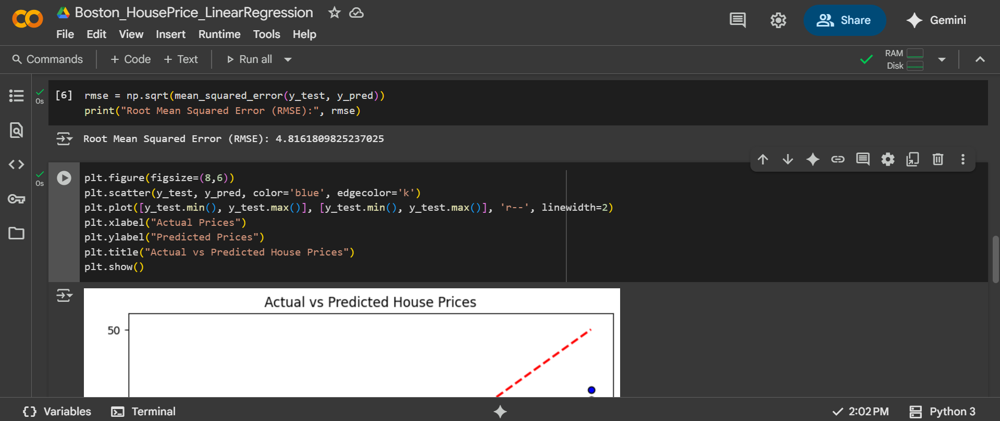
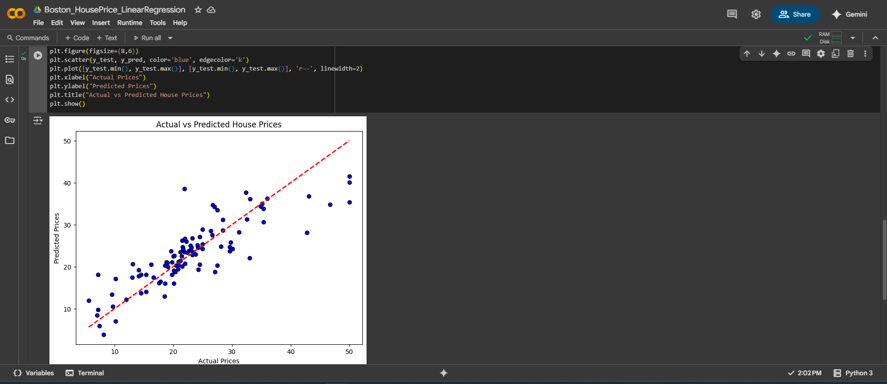

# Boston House Prices Prediction using Linear Regression

## Project Overview
This project predicts Boston house prices using **Linear Regression** and evaluates model performance with visualizations. The goal is to estimate housing prices based on key features in the dataset and assess prediction accuracy using metrics and plots.

## Tasks Performed
- **Data Loading:** Loaded the Boston Housing dataset using `tf.keras.datasets.boston_housing`.
- **Data Preprocessing:** Scaled the features using `StandardScaler`.
- **Model Training:** Trained a `LinearRegression` model on the scaled training data.
- **Model Evaluation:**
  - Computed **Root Mean Squared Error (RMSE)** on the test set.
  - Plotted **Actual vs Predicted** prices.
- **Prediction:** Generated predictions on the held-out test set.

## Key Insights
- Linear Regression provides a reasonable baseline for house price prediction.
- RMSE reflects the average prediction error.
- Scatter plot shows how close predictions are to actual prices.

## Files in this Repository
- `Boston_House_Prediction.ipynb` – Jupyter Notebook with code, predictions, metrics, and plots.
- `Screenshots1` – Folder containing output screenshots:
  - `RMSE_Output.png` – RMSE evaluation result
  - `Actual_vs_Predicted_Plot.png` – Scatter plot of true vs predicted prices

## How to Run
1. Open `Boston_House_Prediction.ipynb` in **Google Colab** or a local Jupyter Notebook environment.
2. Run the cells sequentially to see:
   - Dataset overview
   - Model training
   - Predictions
   - Evaluation metrics
   - Visualizations

## Visuals
### RMSE Output

### Actual vs Predicted Plot

## Dependencies
- Python 3.x
- `numpy`
- `pandas`
- `matplotlib`
- `scikit-learn`
- `tensorflow`
